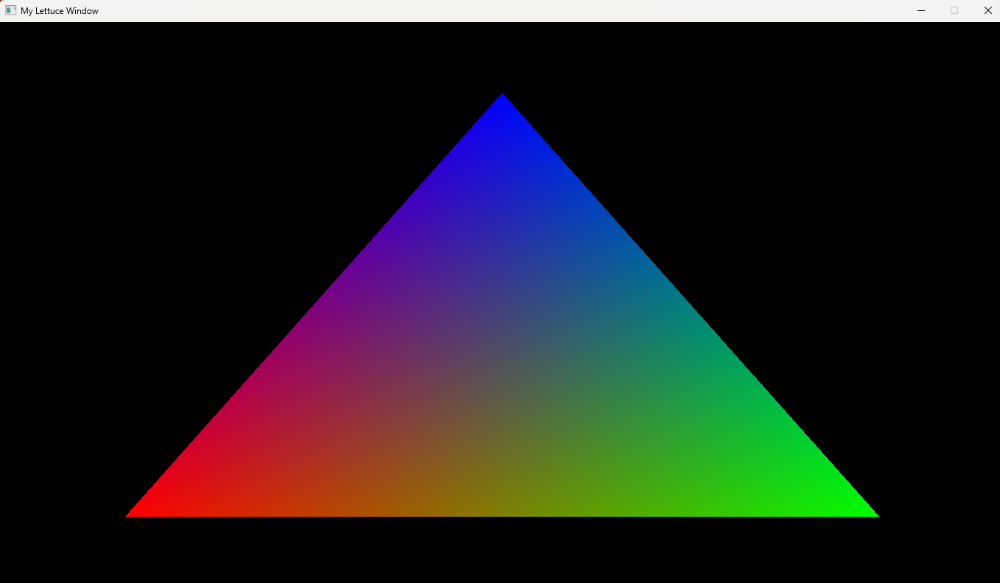
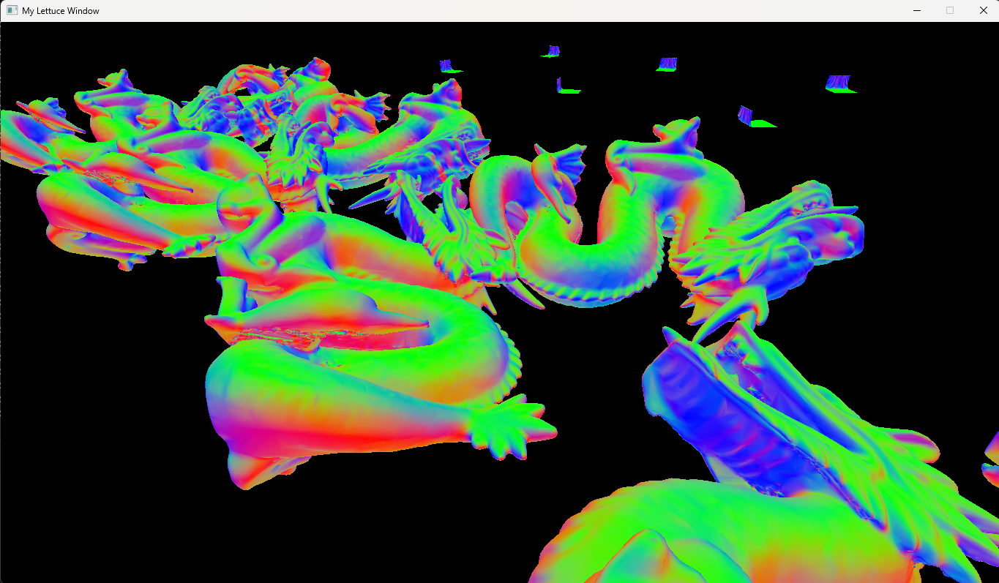
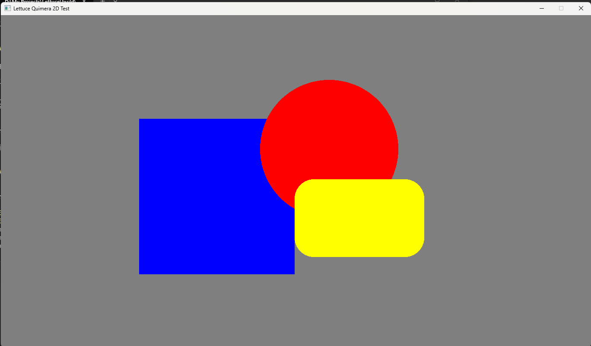
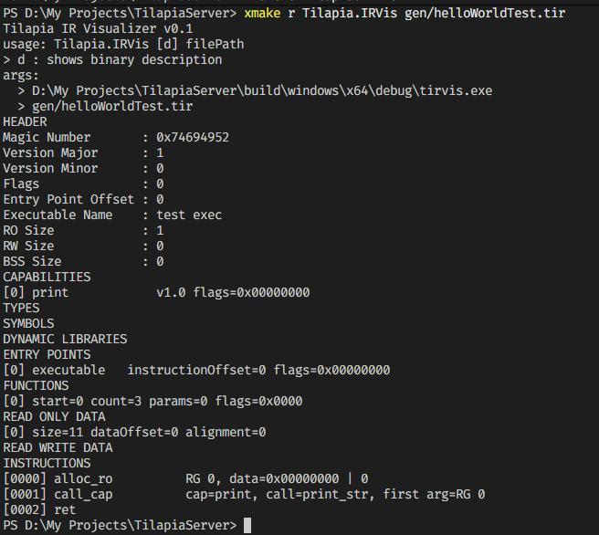
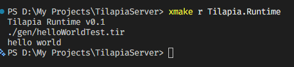
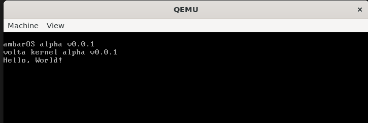

# Hello, I'm Piero :D

- Computer Science student passionate about Computer Graphics, CPU & GPU architecture, pure mathematics, and physics.
- As you can probably tell, I'm all about computer architecture.

# Current Projects

- **Lettuce**: A Vulkan graphics library built for desktop applications. There are a few demos if you want to try it out.

| Lettuce Core | Lettuce Rendering | Lettuce Quimera |
| :---: | :---: | :---: |
|  |   |  |

- **Tilapia Server**: A server-side framework built around a daemon, runtime, and IR. Written in C++23 on top of Winsock RIO, with an io_uring backend coming soon. (WIP)

| Tilaria IR Visualizer | Tilapia Runtime |
| :---: | :---: | 
|  |   |

- **ambarOS**: A hobby operating system and microkernel written in C++23. Built for the fun of it, and yes, it boots in QEMU. (WIP)

| ambarOS init |
| :---: |
|  | 
# What do I use?

- C++23 for anything performance-critical, built with GCC, Clang, or MSVC.
- Python when I absolutely need scripting.
- NASM whenever I write x86_64 assembly.
- Shaders? Slang.
- Vulkan is my primary graphics API, but I can work with DirectX 12 too.
- For web apps I use Bun or Node with Hono, and Vue is my frontend framework of choice.
- Windows 11 is my daily driver. I have no problem using Linux either—I just use whatever gets the job done.
- CMake? Just use xmake, Python scripts, or literally anything that's actually human-readable.

# What do I build?

- High-performance software, real-time graphics, shaders, and low-level systems.
- Currently diving deeper into real-time rendering and high-performance networking (Winsock RIO and friends).
- Audio programming is next on the list. I just need more hours in the day.

# Why am I like this?

- The conventional way is overrated. I'd rather understand how something works before I use it.
- If it's considered "too low-level", that's usually where I get interested.
- Maybe that's obsession. I call it curiosity.